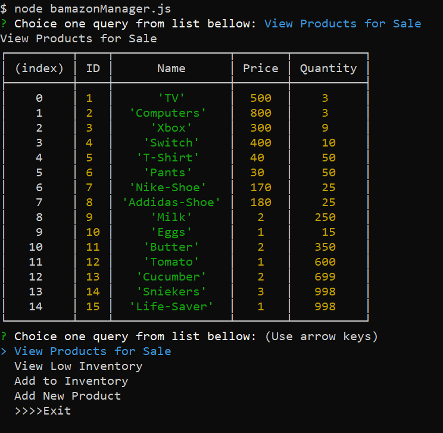

# bamazon_Node.JS_MYSQL

* bamazonCustomer app 
        is an app built using JS, Node.js, and mysql.
        table of products will be display and user can point to products needed by using item ID number and then ask for quantity.
        our backend will send request to our database to find if we have enough of the quantity requested.
        if we do will give user a total cost and update our DB to reflect items sold.
        if we don't will let user know and prompt it to adjust order.

* bamazomManager app 
        is an app allows manager to do following tasks:
        Allows manager to select View Products for Sale, the app can list every available item: the item IDs, names, prices, and                 quantities.
        Allows manager to select View Low Inventory that inventory count lower than five.
        Allows manager to select Add to inventory and add to any item currently in the store.
        Allows manager to select Add New Product, to add a completely new product to the store.

* bamazonSupervisor app allow the supervisor to:
        view prduct sales by department, 
        our app will prompt a list of deparments to select one, than will take the answer and run quary to display a table holds:
        department ID, name, over head cost, produect sold, and on fly to caluclate the profit and dislay it as well.
# App Demo
https://drive.google.com/file/d/1IQE_Ecq5ZJMKTNl4MFstO2QVf74FHR7R/view

# How to Run in Your PC:
 - Clone the app from github using this link: https://github.com/ramezray/bamazon_Node.JS_MYSQL.git
 - Run NPM i mysql inquire chalk (make sure you have node.js installed)
 - From same dir run "node bamazonCustomer.js OR node bamazonManager.js OR node bamazonSupervisor.js

# ScreenShots
* Customer App
-  
* Manager App
- 
- 
- 
- 

* Supervisor App
- 

# Technologies used
* JavaScript
* Node.js
* mysql NPM
* inquire NPM
* chalk NPM
* Path
 
 # Author
 *Ray Wasif*

